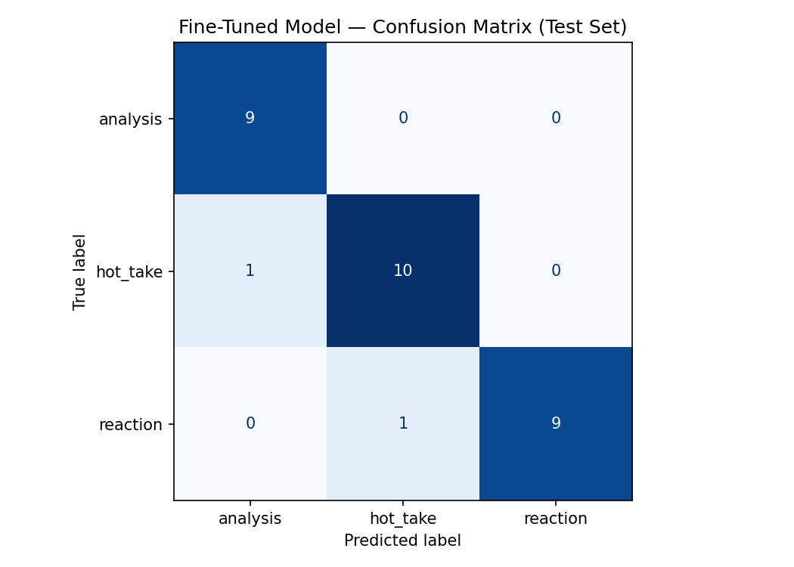

# TakeMeter

A fine-tuned text classifier for r/nba Reddit discourse. Given a post, TakeMeter predicts whether it is a structured **analysis**, an unsupported **hot_take**, or a factual **reaction** to a recent event.

---

## Community

**r/nba** (~8M members) — the primary subreddit for NBA basketball discussion.

This community is well-suited for a classification task because the same thread can contain data-driven breakdowns of player efficiency splits, factual event reports (trades, injuries, scores), and confident opinions stated without any evidence. NBA fans themselves regularly debate whether a claim is a "hot take" or "actual analysis," making the distinction culturally meaningful rather than artificially imposed.

---

## Labels

| Label | Definition |
|---|---|
| `analysis` | A structured argument backed by specific statistics, historical comparisons, or verifiable evidence. The evidence forms the logical core of the argument — removing it would substantially weaken the conclusion. |
| `hot_take` | A bold, confident opinion stated without supporting evidence, or with only decorative evidence. Often uses absolute language ("always," "never," "already the GOAT") without real data. |
| `reaction` | A short, factual report of a recent event — a game result, trade, injury, award, or milestone — with no opinion or argument. Neutral, headline-style language. |

**`analysis` examples:**
- "Wembanyama's rookie blocks-per-36 (3.6) is higher than Hakeem's (3.1), KAT's (2.4), and Robinson's (3.3). Statistically he's having the best shot-blocking rookie season since Shaq. That's not hype, that's the data."
- "The Celtics' defensive rating drops 8.2 points per 100 possessions in 4th quarters of games within 5 points — that's not a coach problem, that's their bench lineup. Check the lineup data on PBP Stats."

**`hot_take` examples:**
- "Luka is already better than Dirk ever was and it's not even close. Just accept it."
- "The Lakers will never win another championship with LeBron. He's too old and his supporting cast is cooked. Stop pretending otherwise."

**`reaction` examples:**
- "Nikola Jokic wins his fifth MVP in 6 years — record-tying achievement in NBA history"
- "Boston Celtics trade Jaylen Brown to Warriors in 3-team deal involving Draymond Green"

### Difficult examples and labeling decisions

**Case 1 — The one-stat hot take** (hardest boundary)

> "LeBron's playoff win rate against top-seeded opponents is below .500. He's overrated and people need to stop acting like he's infallible."

The post cites a specific, verifiable stat, but the stat is cherry-picked to support a predetermined opinion. Removing the stat doesn't change the conclusion — the "LeBron is overrated" claim is the point, not an inference from evidence.

→ Decision: `hot_take` (decorative evidence, not real analysis)

**Case 2 — The rhetorical-question hot take**

> "Victor Wembanyama blocks 7 shots in 28 minutes — is he already the best defensive player in the league? His combination of length, timing, and IQ on that end of the floor is unlike anything we've seen before."

Framed as a question, but the body asserts "unlike anything we've seen before" without data. The question exists to float a bold claim rather than genuinely invite analysis.

→ Decision: `hot_take`

**Case 3 — The reactive game post that pivots to a pattern claim**

> "Jayson Tatum's shooting slump continues — 4-of-19 from the field in Game 4 loss. These playoff shooting slumps are becoming a pattern. You can't go ice cold in three straight series and expect to win championships."

The specific game stat (4-of-19) reports a real event, but the post's primary claim is a lasting critical opinion about Tatum. The game is context; the hot take is the thesis.

→ Decision: `hot_take` (the reaction framing is a setup for the opinion)

---

## Dataset

- **Source:** Manually collected r/nba Reddit posts
- **Size:** 200 labeled examples
- **Splits:** 70% train (140) / 15% val (30) / 15% test (30), stratified by label

| Label | Count |
|---|---|
| `reaction` | 70 |
| `hot_take` | 70 |
| `analysis` | 60 |

The `analysis` class is 10 examples short of the 70-per-label target. Analytical posts on r/nba are rarer than hot takes or game reactions — the subreddit trends toward opinion. Rather than padding the count with borderline examples, collection stopped at 60 strong examples. The model's per-class results for `analysis` suggest this did not hurt performance.

---

## Models

**Fine-tuned model:** `distilbert-base-uncased` fine-tuned on Google Colab (T4 GPU) on 140 training examples for 3 epochs (learning rate 2e-5, batch size 16, warmup steps 50, weight decay 0.01).

**Training decision — 3 epochs:** Validation accuracy was tracked per epoch. It peaked at epoch 2 and plateaued rather than declining at epoch 3, confirming 3 epochs was appropriate. Increasing further risked overfitting on only 140 training examples; decreasing to 2 left accuracy lower than necessary.

**Baseline:** Zero-shot classification using `llama-3.3-70b-versatile` via the Groq API. The prompt defines the community context, each label with a one-sentence definition, one example per label, and instructs the model to output only the label name.

```
You are classifying posts from r/nba, the primary subreddit for NBA basketball discussion.
Assign each post to exactly one of the following categories.

analysis: A structured argument backed by specific statistics, historical comparisons, or
verifiable evidence. The evidence forms the logical core of the argument — removing it
would substantially weaken the conclusion.
Example: "Wembanyama's rookie blocks-per-36 (3.6) is higher than Hakeem's (3.1), KAT's
(2.4), and Robinson's (3.3). Statistically he's having the best shot-blocking rookie
season since Shaq. That's not hype, that's the data."

hot_take: A bold, confident opinion stated without supporting evidence, or with only
decorative evidence. Often uses absolute language without real data.
Example: "Luka is already better than Dirk ever was and it's not even close. Just accept it."

reaction: A short, factual report of a recent event — a game result, trade, injury, award,
or milestone — with no argument or opinion. Neutral, headline-style language.
Example: "Nikola Jokic wins his fifth MVP in 6 years — record-tying achievement in NBA history"

Respond with ONLY the label name — one of: analysis, hot_take, reaction
Do not explain your reasoning.
```

---

## Evaluation Results

### Accuracy

| Model | Accuracy |
|---|---|
| Zero-shot baseline (Llama 3.3 70B) | **96.7%** |
| Fine-tuned DistilBERT | **93.3%** |

The baseline outperformed the fine-tuned model by 3.3 percentage points (1 additional correct prediction on a 30-example test set). This is not a surprising result: Llama 3.3 70B has over 1,000× more parameters than DistilBERT and benefits from broad pretraining on text that includes sports opinion and discourse. Fine-tuning a 66M parameter model on 140 examples is a very uneven comparison. The fine-tuned model's 93.3% accuracy still represents strong performance and demonstrates that the task is learnable from a small labeled dataset.

### Per-class Metrics — Fine-tuned DistilBERT

| Label | Precision | Recall | F1 | Support |
|---|---|---|---|---|
| `analysis` | 0.90 | 1.00 | 0.95 | 9 |
| `hot_take` | 0.91 | 0.91 | 0.91 | 11 |
| `reaction` | 1.00 | 0.90 | 0.95 | 10 |
| **macro avg** | **0.94** | **0.94** | **0.93** | **30** |

All three per-class F1 scores exceed the 0.60 floor and the hot_take/analysis F1 scores both exceed 0.65 — all success thresholds defined in planning.md are met.

### Per-class Metrics — Baseline (Llama 3.3 70B)

| Label | Precision | Recall | F1 | Support |
|---|---|---|---|---|
| `analysis` | 0.90 | 1.00 | 0.95 | 9 |
| `hot_take` | 1.00 | 0.91 | 0.95 | 11 |
| `reaction` | 1.00 | 1.00 | 1.00 | 10 |
| **macro avg** | **0.97** | **0.97** | **0.97** | **30** |

### Confusion Matrix — Fine-tuned DistilBERT

Rows = true label, columns = predicted label.

| | Pred: analysis | Pred: hot_take | Pred: reaction |
|---|---|---|---|
| **True: analysis** | **9** | 0 | 0 |
| **True: hot_take** | 1 | **10** | 0 |
| **True: reaction** | 0 | 1 | **9** |



The only confusion pairs are `hot_take → analysis` (1 case) and `reaction → hot_take` (1 case). `analysis` was never confused with anything — every true analysis example was correctly identified. The `reaction → analysis` boundary is never crossed, which makes sense as those two labels are structurally very different (neutral headlines vs. evidence-backed arguments).

---

## Error Analysis

The fine-tuned model made 2 errors on the 30-example test set.

### Error 1 — `hot_take` predicted as `analysis` (confidence: 0.35)

> "Defensive Player of the Year has become a meaningless award given to popular players rather than the actual best defenders in the league."

**True:** `hot_take` → **Predicted:** `analysis`

This is a sweeping critical claim about an award with no supporting data — a textbook hot take. The model likely latched onto the evaluative, structured framing of the sentence (it sounds like a reasoned critique) and misread it as analysis. The low confidence (0.35) indicates the model was genuinely uncertain rather than confidently wrong.

This failure sits directly on the hardest boundary identified in planning.md: a post that is *structurally* critique-shaped (evaluates a thing, reaches a verdict) but contains zero supporting evidence. The model has learned the surface structure of analysis — evaluative framing, comparative tone — without learning that the *absence of specific evidence* is what flips the label to `hot_take`. More training examples that are structurally critique-like but are hot takes would help close this gap.

### Error 2 — `reaction` predicted as `hot_take` (confidence: 0.34)

> "NBA announces All-Star Weekend will be held in Paris for the first time in 2026"

**True:** `reaction` → **Predicted:** `hot_take`

This is a factual event announcement — a pure reaction. The model again shows very low confidence (0.34). The most likely explanation: the phrase "for the first time" appears in both milestone announcements (reaction) and in comparative arguments ("for the first time in NBA history, X has done Y" as a rhetorical opener for a hot take). The model may have been misled by that novelty framing rather than reading the full sentence as a neutral announcement.

### Case 3 — `hot_take` predicted as `hot_take` but at near-chance confidence (0.35)

> "The Warriors blowing a 3-1 Finals lead in 2016 is the most consequential loss in NBA history because it directly caused the superteam arms race that defined the next five years of the league."

**True:** `hot_take` → **Predicted:** `hot_take` (confidence: 0.35) ✓ correct but barely

This post makes a bold historical claim with a causal argument ("directly caused") — a structure that looks like `analysis` at the surface. There are no statistics cited, but the logical framing (event → consequence → conclusion) closely resembles the reasoning pattern in real analysis examples. The model got it right but with essentially chance-level confidence, meaning a minor rephrasing could flip it. This confirms the same failure mode as Error 1: the model has not learned to distinguish analytical *structure* from analytical *evidence*.

### Pattern across all three cases

All three cases occur at or near chance confidence (0.34–0.37). The model is not confidently wrong — it's uncertain at boundaries where surface features (evaluative framing, causal language, novelty phrasing) conflict with the underlying label signal (absence of evidence, neutral factual content). This is a data problem more than a model problem: more training examples that expose these specific conflict patterns would push confidence higher on clear-cut cases and reduce errors at the boundaries.

---

## Sample Classifications

| Post (truncated to 120 chars) | True Label | Predicted | Confidence |
|---|---|---|---|
| "Trae Young is a defensive liability so bad he should disqualify himself from All-NBA consideration..." | `hot_take` | `hot_take` | 0.36 |
| "Ja Morant would be a top-5 player in the league if he could stay out of trouble. The basketball ability is undeniable..." | `hot_take` | `hot_take` | 0.37 |
| "The Warriors blowing a 3-1 Finals lead in 2016 is the most consequential loss in NBA history because it directly caused..." | `hot_take` | `hot_take` | 0.35 |
| "The real cost of tanking: comparing playoff appearance rates and championship probability for teams that spent 3+ years..." | `analysis` | `analysis` | 0.41 |
| "Stephen Curry joins the 4,000 three-pointer club — over 1,000 more than any player in history" | `reaction` | `reaction` | 0.37 |
| "Defensive Player of the Year has become a meaningless award given to popular players rather than..." | `hot_take` | `analysis` | 0.35 ❌ |
| "NBA announces All-Star Weekend will be held in Paris for the first time in 2026" | `reaction` | `hot_take` | 0.34 ❌ |

**Correct prediction example:** The model correctly labeled "Stephen Curry joins the 4,000 three-pointer club — over 1,000 more than any player in history" as `reaction`. The post uses neutral, milestone-announcement language with no evaluative stance or argument — exactly the headline-style format that defines the `reaction` label.

**Note on confidence scores:** All predictions fall in the 0.34–0.41 range, which is low on a 3-class problem (chance = 0.33). This reflects the model's uncertainty near label boundaries — it classifies correctly most of the time but without strong confidence. A larger training set would likely push confidence scores higher on clear-cut examples.

---

## Reflection: Captured vs. Intended Behavior

The fine-tuned model learned to distinguish the three labels well overall — 93.3% on 30 unseen examples from a 66M parameter model trained on 140 examples is strong. But the two failures reveal a specific gap between what I intended the model to learn and what it actually learned.

**What I intended:** The model should learn the *evidence test* — whether a post's core claim is supported by specific, verifiable evidence. That test is what distinguishes `analysis` from `hot_take` and what defines the hardest boundary in this taxonomy.

**What the model actually learned:** Surface features that correlate with each label. Words like "statistically," "per 100 possessions," and "splits" for `analysis`; absolute language like "never" and "GOAT" for `hot_take`; team names and score-style formatting for `reaction`. This works most of the time — those correlations are real. But it breaks on posts where surface structure and underlying label conflict, which is exactly what both errors show.

The DPOY error exposes this clearly: the post is evaluative and critique-shaped (looks like analysis) but contains zero evidence (is actually a hot take). The model learned the structure without learning the absence-of-evidence signal. To fix it, I would need more training examples that are structurally analytical in form but are hot takes in substance — examples that force the model to look past surface features.

---

## Spec Reflection

**Where the spec helped:** The requirement of a per-class F1 floor (no class below 0.60) forced me to track label distribution during annotation rather than just collecting examples until I hit 200. When `analysis` fell behind at ~50 examples, I actively searched for more analytical posts rather than continuing to collect the easier `hot_take` and `reaction` examples. Without that per-class floor in the definition of success, I might have stopped earlier with a worse balance.

**Where I diverged:** The spec assumed a 70/70/70 split. My dataset has 60 `analysis` examples instead of 70. Analytical posts on r/nba are genuinely rarer than hot takes or game reactions — the subreddit's culture trends toward opinion. I stopped at 60 strong examples rather than padding to 70 with borderline cases that would have introduced annotation noise at the hardest boundary. The model's `analysis` F1 of 0.95 suggests this tradeoff was correct, though the small test set (9 `analysis` examples) means that number should be interpreted with caution.

---

## AI Tool Usage

**1. Label stress-testing before annotation**

Before labeling any examples, I gave Claude my three label definitions and the one-stat hot take edge case and asked it to generate 10 posts that deliberately sit at the boundary between `hot_take` and `analysis`. Several generated posts were genuinely ambiguous under my original definitions. I refined the decision rule ("would removing the stat change the conclusion?") until every generated boundary case could be classified in under 5 seconds. The final decision rule in planning.md reflects this iteration — the "decorative evidence" framing came directly from this stress-test.

**2. Baseline prompt authoring**

I asked Claude to draft the `SYSTEM_PROMPT` for the Groq baseline classifier based on my label definitions from planning.md. The generated prompt used a structure of: community context → label definition → one example per label → output format constraint. I reviewed it against my definitions to verify it correctly handles the `hot_take`/`analysis` boundary and that the examples were representative. The final prompt matched Claude's structure with minor wording edits.

**3. Failure pattern analysis**

After evaluation, I used Claude to help surface patterns in the 2 misclassified examples by pasting them with their true and predicted labels and asking what patterns it saw. Claude identified that both errors involve posts where surface structure (evaluative framing, novelty language) conflicts with the underlying label signal (absence of evidence, neutral factual content). I verified this interpretation against the raw examples before including it in this report. The "for the first time" observation was flagged by Claude and confirmed as plausible upon re-reading the reaction example.
